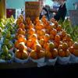

# Image-Caption-Pairs
This report explores two multimodal TensorFlow models to determine whether a given text description matches an associated image, without relying on pre-trained models. 

### Dataset
The dataset consists of train, validation, and test datasets. Each dataset consists of two components: a CSV file with three columns, one for the image ID (the names of the image files), one for the caption, and one for the label, and a folder containing the images. The test dataset does not include the label.

| Image | Caption | Label |
|:------------------:|:----------:|:----------:|
|  | Wet elephants shake water onto people bathing them. | 0 |
|  | A fruit stand has various fruits on the table. | 1 |

### Approach
To solve this problem, I needed to use two main models, one for the images and one for the text data, and another model that would combine the two results and output 1 if the image and caption matched and 0 otherwise. Before feature extraction, the text and image data are cleaned and prepared to be inputs. For the assignment, I had to create two different versions.

The first version uses a CNN and GRU architecture, where the CNN extracts image features, and the text input is then processed sequentially by a GRU network. The second version adopts a ViT and LSTM approach, where a Vision Transformer extracts image patches, and an LSTM processes the textual information.

To determine if the caption and the image match, I calculate the cosine similarity, and then map the output from [-1; 1] to [0; 1] using a dense layer and the activation function sigmoid. The outputs of the image and text models must have the same shape.

### Results
For the validation dataset, the best result was obtained with the models from the file CNN+GRU_sub6.py, with an accuracy of 69% and a loss of 0.6359. 

The full documentation can be found in the PDF file.

This project was a part of a university assignment; thus, I am unable to publish the dataset used.
